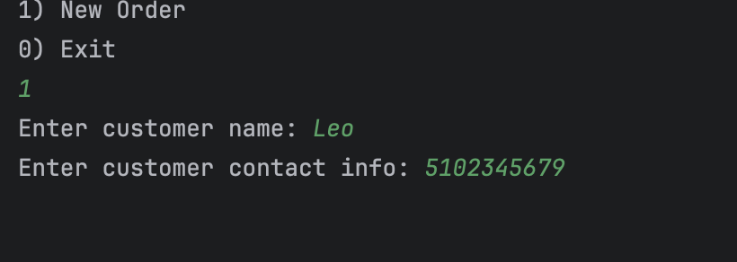
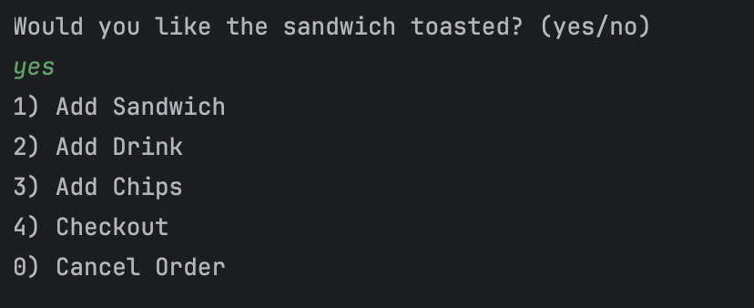

# DELI-cious-

# My Project overview

============================

For this application the customer at a local deli shop wanted to start incorparting online orders for there business. I made an application that lets the customer make their sandwich based on the menu options. Also let's them get a drink, chips and at the end gives them a total receipt. A file is printed with the copy of the receipt after the order is completed.

This is the menu intro the customer is greeted with giving them two options to make a new order or exit the application.

The application asks the user to put their contact info so they could track their order

Once the user starts a new order it takes the customer to the screen where they can choose the type of bread they would like

The next screen takes the user to pick the sandwich size they would like

The following screen gives the user the menu to pick their toppings. It gives them up to 27 options, the customer can pick any of the items on the list for there sandwich

The next screen asks the user if they would like their sandwich toasted

Once the user is done making their sandwich, the customer can get a drink from 3 different options.

Another side the user can get is a bag of chips to go with their meal

Once the full order is completed the receipt for the order is printed. Giving the user their total for all the items in the order
